# Decentralized Enterprise AI Agent Platform (DEAAP)

## Project Overview

The Decentralized Enterprise AI Agent Platform (DEAAP) is a comprehensive microservices architecture that transforms enterprise documents into validated, traceable AI agent capabilities. By integrating advanced document processing with blockchain-based consensus validation, DEAAP enables Business Units (BUs) to securely contribute data while maintaining privacy and ensuring corporate responsibility in AI agent deployment.

### Key Innovation

DEAAP bridges the gap between document ingestion and AI agent deployment through:
- **Verifiable Data Processing**: Convert PDFs to structured data assets (LORA adaptors + embeddings)
- **Democratic Consensus**: Multi-BU validation of data usage authorization through Cartesi-powered off-chain computation
- **Traceable AI Agents**: Complete audit trail from document source to agent deployment
- **Corporate Responsibility**: Transparent data usage decisions with stakeholder accountability

### Core Value Proposition

1. **Document-to-Agent Pipeline**: Transform unstructured PDFs into production-ready AI agents with full traceability
2. **Multi-Stakeholder Validation**: Enable distributed Business Units to validate data usage without exposing sensitive content
3. **Blockchain Verifiability**: Immutable records of all validation decisions and data usage authorizations
4. **Privacy-Preserving Consensus**: Cartesi off-chain computation ensures validation logic remains confidential while results are verifiable

## Architecture Overview


## System Components

### 1. Document Ingestion Layer
- **Doc Ingester Service**: FastAPI service handling PDF upload and processing
- **Mineru Engine**: PDF to markdown conversion with layout preservation
- **YY-Chunkers**: Multiple chunking strategies (semantic, fixed-token, etc.)

### 2. Data Processing Layer
- **Synthetic Dataset Generator**: Creates training datasets from document chunks
- **Embedding Generator**: Converts chunks to vector embeddings
- **LORA Adaptor Service**: Generates fine-tuning adaptors
- **Vector Database**: Stores embeddings with metadata

### 3. Blockchain Consensus Layer
- **Blockchain Node**: Ethereum-compatible chain for consensus recording
- **Consensus Manager**: Orchestrates validation across BU nodes
- **BU Validator Nodes**: Per-BU validation nodes with custom logic

### 4. Authorization & Orchestration Layer
- **Authorization Service**: Manages data usage permissions
- **Traceability Service**: Tracks data lineage and validation history
- **Agent Orchestrator**: Assembles validated components into agents

### 5. LLM Agent Layer
- **LLM Runtime**: Model serving with LORA adaptors
- **RAG System**: Retrieval-augmented generation with validated embeddings

## Key Features

### 🔐 Decentralized Validation
- Each BU operates independent validator nodes
- Customizable validation logic per BU
- Consensus-based authorization decisions

### 📊 Data Privacy & Sovereignty
- BUs maintain control over their data usage
- Cryptographic proof of validation
- Auditable decision trails

### 🤖 Enterprise AI Agents
- Domain-specific agent composition
- Validated LORA adaptors + embeddings
- Corporate responsibility integration

### 🏢 Multi-BU Architecture
- Isolated validation environments
- Cross-BU data sharing controls
- Scalable consensus mechanisms

## Deployment Modes

### Development Mode (Mock Validation)
```bash
docker compose --profile development up
```
- Fast development cycles
- Simulated validation consensus
- Local blockchain network

### Production Mode (Real Validation)
```bash
docker compose --profile production up
```
- Full Cartesi-based validation
- Cryptographic proof generation
- Multi-BU consensus network

### Testing Mode (Hybrid)
```bash
docker compose --profile development --profile production up
```
- Side-by-side validation comparison
- Migration testing capabilities
- Performance benchmarking

## Quick Start

### Prerequisites
- Docker & Docker Compose
- NVIDIA GPU support (for ML workloads)
- Minimum 16GB RAM
- 100GB+ storage

### Initial Setup
```bash
# Clone and navigate
git clone <repository>
cd RomanticNoRush

# Configure environment
cp .env.template .env
# Edit .env with your specific configuration

# Start development environment
docker compose --profile development up -d

# Verify services
./scripts/health-check.sh
```

### First Document Processing
```bash
# Upload a PDF document
curl -X POST "http://localhost:8752/transform" \
  -H "Content-Type: application/json" \
  -d '{
    "url": "path/to/your/document.pdf",
    "chunk_method": ["CLUSTER_SEMANTIC"],
    "chunk_max_size": 5100
  }'

# Check processing status
curl "http://localhost:8752/status/{task_id}"
```

### Deploy a BU Validator Node
```bash
# Configure BU-specific validation logic
cp validator-templates/bu-template validator-configs/my-bu

# Deploy validator
docker compose -f docker-compose.validator.yml up -d

# Register with consensus network
./scripts/register-validator.sh my-bu
```

## Directory Structure

```
RomanticNoRush/
├── services/                    # Microservice implementations
│   ├── doc-ingester/           # Document processing service
│   ├── data-processor/         # Synthetic data & embeddings
│   ├── consensus-manager/      # Blockchain consensus
│   ├── bu-validator/          # BU validation node template
│   ├── authorization/         # Authorization & traceability
│   └── agent-orchestrator/    # LLM agent assembly
├── blockchain/                 # Smart contracts & blockchain
├── configs/                   # Configuration templates
├── scripts/                   # Deployment & management scripts
├── docs/                      # Technical documentation
├── docker-compose.yml         # Main orchestration
├── docker-compose.validator.yml # BU validator deployment
└── README.md                  # This file
```

## Data Flow Diagram

```mermaid
sequenceDiagram
    participant User
    participant DI as Doc Ingester
    participant DP as Data Processor
    participant CM as Consensus Manager
    participant BV as BU Validators
    participant BC as Blockchain
    participant AO as Agent Orchestrator
    participant Agent as LLM Agent

    User->>DI: Upload PDF
    DI->>DI: PDF → Markdown → Chunks
    DI->>DP: Send chunks
    DP->>DP: Generate datasets & embeddings
    DP->>CM: Request validation
    CM->>BV: Distribute validation tasks
    BV->>BV: Execute custom validation logic
    BV->>BC: Submit validation results
    BC->>BC: Record consensus
    BC->>AO: Validation complete
    AO->>Agent: Assemble validated components
    Agent->>User: Ready for queries
```



## Security & Compliance

### Data Protection
- End-to-end encryption for data transfer
- Isolated validation environments per BU
- Cryptographic proof of computation integrity

### Audit Trail
- Complete data lineage tracking
- Immutable validation records
- Corporate responsibility mapping

### Access Control
- Role-based permissions per BU
- Multi-signature authorization requirements
- Time-limited data access tokens

## Monitoring & Observability

### Service Health
- Comprehensive health checks for all services
- Real-time performance monitoring
- Automated failover mechanisms

### Business Metrics
- Data processing throughput
- Validation success rates
- Agent performance analytics

### Compliance Reporting
- Automated compliance reports
- Data usage analytics per BU
- Validation audit trails

## Contributing

See [CONTRIBUTING.md](./docs/CONTRIBUTING.md) for development guidelines.

## License

See [LICENSE](./LICENSE) for licensing information.

## Support

- Documentation: [docs/](./docs/)
- Issues: [GitHub Issues](https://github.com/your-org/deaap/issues)
- Discussions: [GitHub Discussions](https://github.com/your-org/deaap/discussions)
