# DEAAP Container Interaction Diagrams

## Overview

This document provides detailed container interaction diagrams for key subsystems within the Decentralized Enterprise AI Agent Platform (DEAAP). These diagrams complement the comprehensive microservices documentation and design specifications already established.

## Table of Contents

1. [Document Processing Subsystem](#document-processing-subsystem)
2. [Consensus Validation Subsystem](#consensus-validation-subsystem)
3. [AI Agent Orchestration Subsystem](#ai-agent-orchestration-subsystem)
4. [Security & Privacy Subsystem](#security--privacy-subsystem)
5. [Data Storage & Retrieval Subsystem](#data-storage--retrieval-subsystem)
6. [Monitoring & Observability Subsystem](#monitoring--observability-subsystem)
7. [Network Architecture Overview](#network-architecture-overview)

---

## Document Processing Subsystem

### Container Interaction Flow

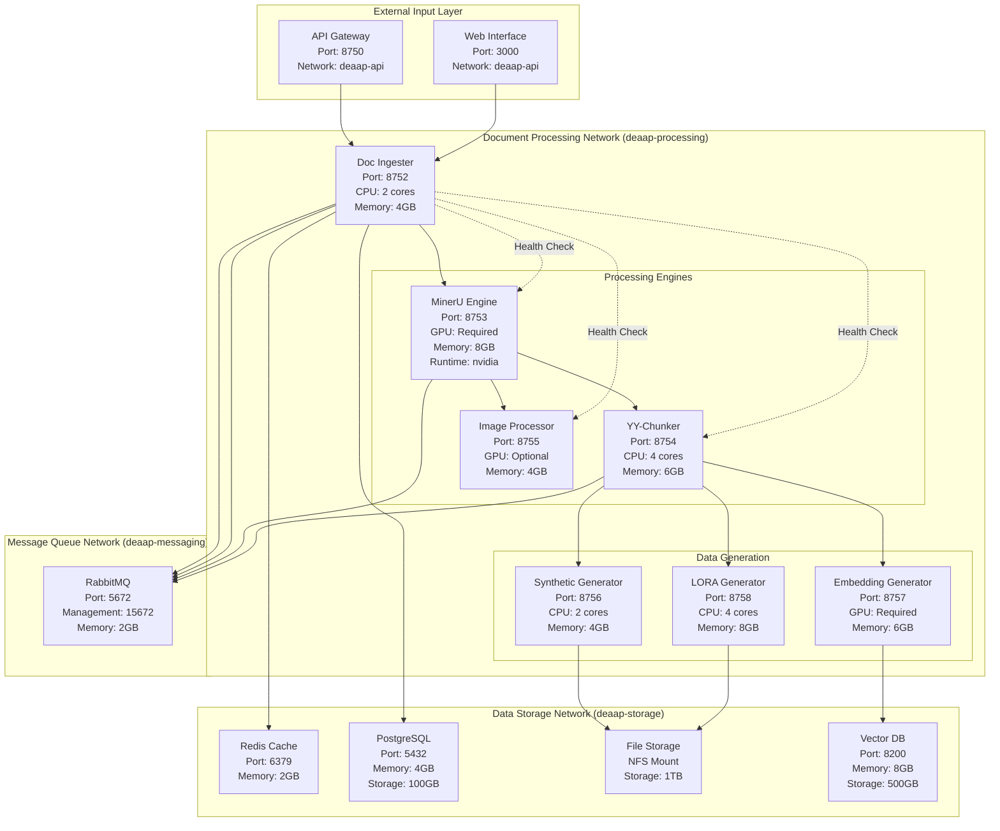

### Container Specifications

| Container | Image | CPU | Memory | Storage | Ports | Networks |
|-----------|-------|-----|--------|---------|-------|----------|
| doc-ingester | deaap/doc-ingester:latest | 2 cores | 4GB | 10GB | 8752:8752 | deaap-processing, deaap-storage |
| mineru | deaap/mineru:v1.3.3 | 4 cores | 8GB | 20GB | 8753:8753 | deaap-processing |
| yy-chunker | deaap/yy-chunker:latest | 4 cores | 6GB | 5GB | 8754:8754 | deaap-processing |
| synthetic-gen | deaap/synthetic-gen:latest | 2 cores | 4GB | 5GB | 8756:8756 | deaap-processing |
| embedding-gen | deaap/embedding-gen:latest | 2 cores | 6GB | 5GB | 8757:8757 | deaap-processing |
| lora-gen | deaap/lora-gen:latest | 4 cores | 8GB | 10GB | 8758:8758 | deaap-processing |

---

## Consensus Validation Subsystem

### Consensus Container Architecture

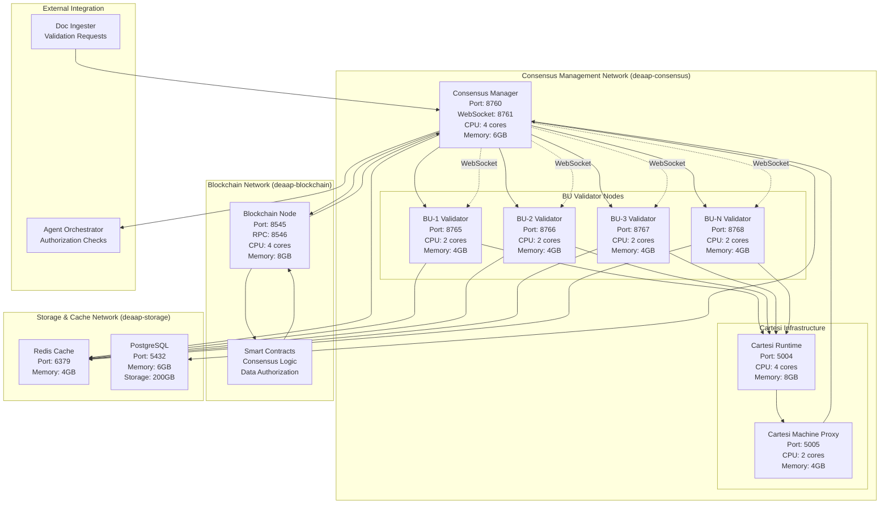

### Consensus Protocol Sequence

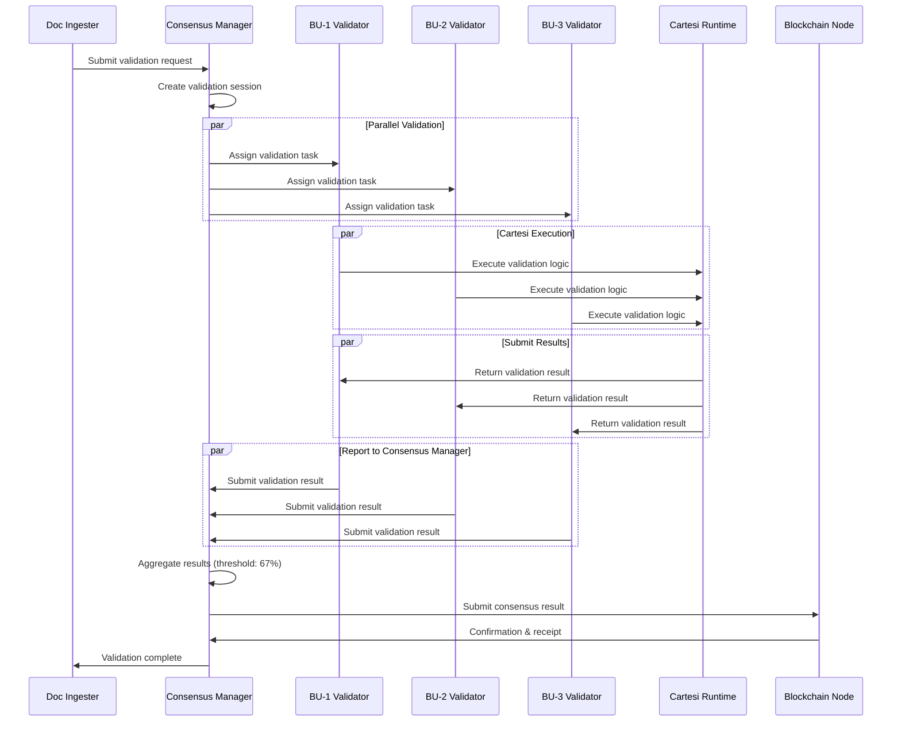

---

## AI Agent Orchestration Subsystem

### Agent Orchestration Architecture

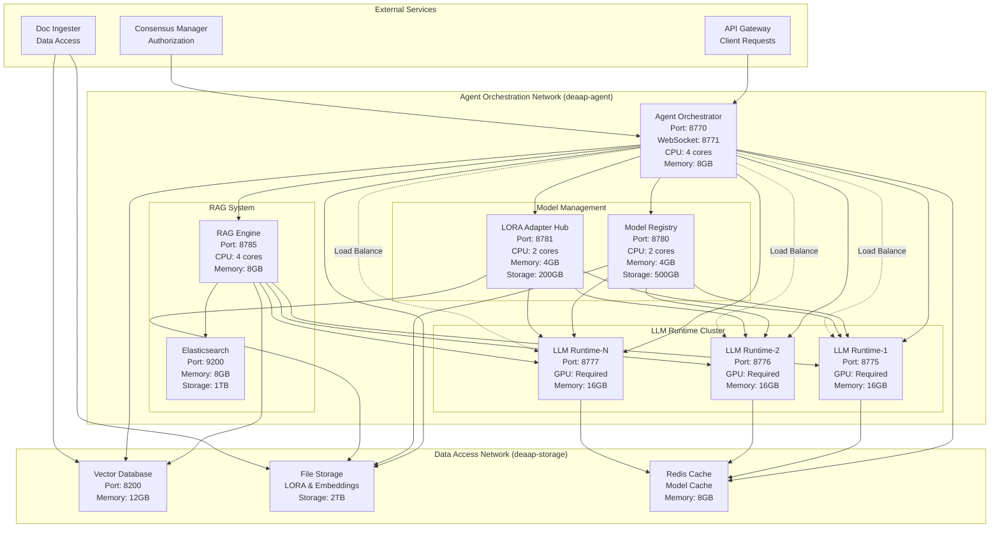

### Agent Lifecycle Management

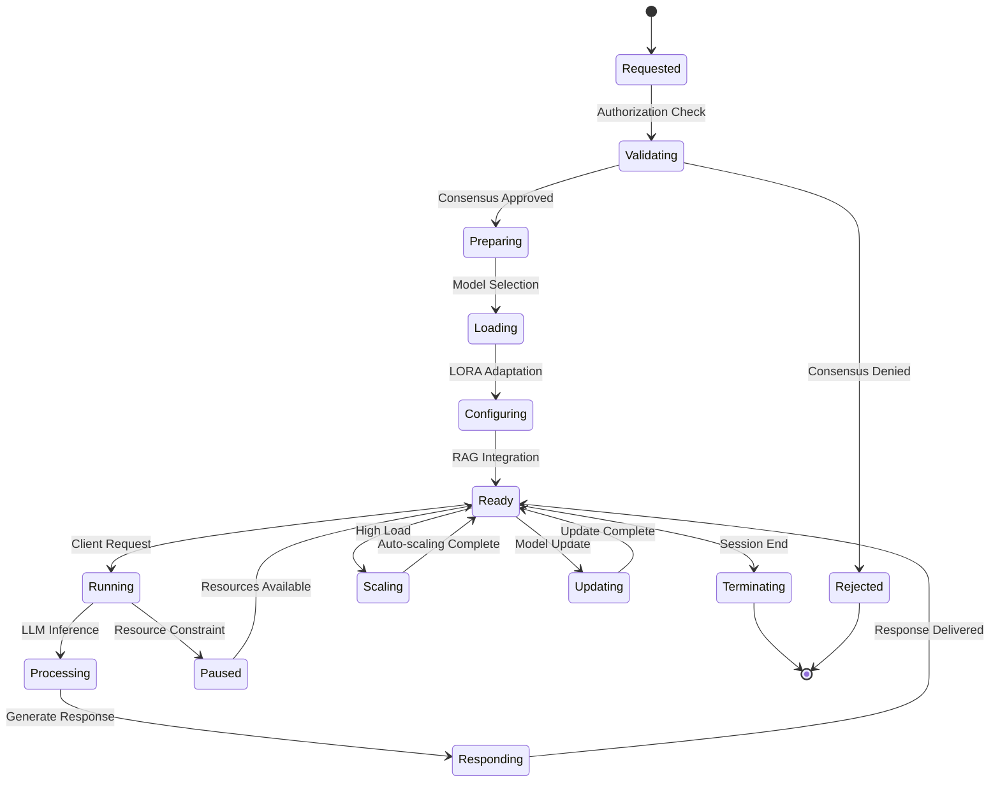

---

## Security & Privacy Subsystem

### Security Infrastructure Architecture

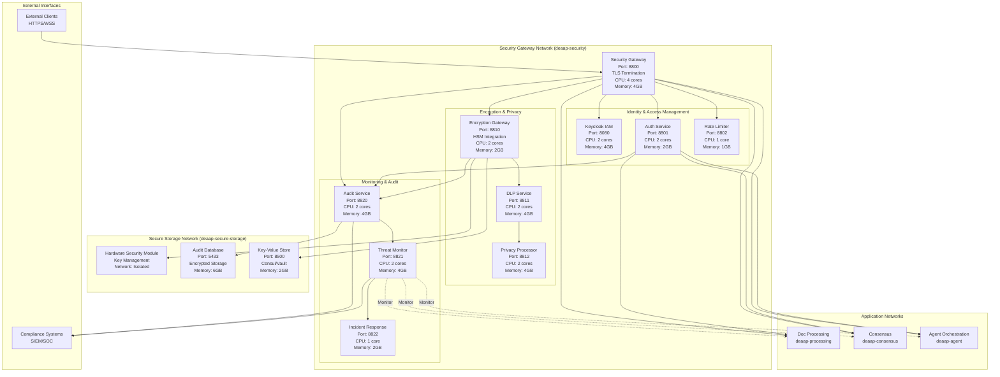

### Security Flow Sequence

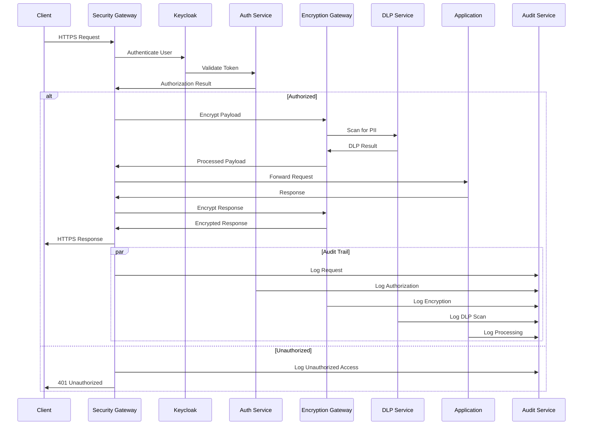

---

## Data Storage & Retrieval Subsystem

### Storage Cluster Architecture

```mermaid
graph TB
    subgraph "Storage Management Network (deaap-storage)"
        SM[Storage Manager<br/>Port: 8900<br/>CPU: 2 cores<br/>Memory: 4GB]
        BM[Backup Manager<br/>Port: 8901<br/>CPU: 2 cores<br/>Memory: 2GB]
        
        subgraph "Primary Storage Cluster"
            PG_M[PostgreSQL Master<br/>Port: 5432<br/>CPU: 4 cores<br/>Memory: 8GB<br/>Storage: 500GB]
            PG_S1[PostgreSQL Slave-1<br/>Port: 5433<br/>CPU: 2 cores<br/>Memory: 6GB<br/>Storage: 500GB]
            PG_S2[PostgreSQL Slave-2<br/>Port: 5434<br/>CPU: 2 cores<br/>Memory: 6GB<br/>Storage: 500GB]
        end
        
        subgraph "Vector Database Cluster"
            VD_M[Vector DB Master<br/>Port: 8200<br/>CPU: 4 cores<br/>Memory: 16GB<br/>Storage: 1TB]
            VD_S1[Vector DB Slave-1<br/>Port: 8201<br/>CPU: 2 cores<br/>Memory: 12GB<br/>Storage: 1TB]
            VD_S2[Vector DB Slave-2<br/>Port: 8202<br/>CPU: 2 cores<br/>Memory: 12GB<br/>Storage: 1TB]
        end
        
        subgraph "Cache Layer"
            RD_M[Redis Master<br/>Port: 6379<br/>CPU: 2 cores<br/>Memory: 8GB]
            RD_S1[Redis Slave-1<br/>Port: 6380<br/>CPU: 1 core<br/>Memory: 6GB]
            RD_S2[Redis Slave-2<br/>Port: 6381<br/>CPU: 1 core<br/>Memory: 6GB]
        end
        
        subgraph "File Storage"
            FS_NFS[NFS Server<br/>Port: 2049<br/>Storage: 5TB<br/>Backup: Daily]
            FS_S3[S3 Compatible<br/>Port: 9000<br/>MinIO Cluster<br/>Storage: 10TB]
        end
    end
    
    subgraph "Backup Network (deaap-backup)"
        BS[Backup Storage<br/>Off-site Replica<br/>Storage: 20TB]
        AR[Archive Service<br/>Port: 8910<br/>Long-term Storage]
    end
    
    subgraph "Application Access"
        APP_READ[Read-Heavy Apps<br/>Doc Ingester, RAG]
        APP_WRITE[Write-Heavy Apps<br/>Consensus, Audit]
        APP_CACHE[Cache Users<br/>LLM Runtime, API Gateway]
    end

    %% Storage management
    SM --> PG_M
    SM --> VD_M
    SM --> RD_M
    SM --> FS_NFS
    SM --> FS_S3
    
    %% Replication
    PG_M --> PG_S1
    PG_M --> PG_S2
    
    VD_M --> VD_S1
    VD_M --> VD_S2
    
    RD_M --> RD_S1
    RD_M --> RD_S2
    
    %% Application access patterns
    APP_READ --> PG_S1
    APP_READ --> PG_S2
    APP_READ --> VD_S1
    APP_READ --> VD_S2
    
    APP_WRITE --> PG_M
    APP_WRITE --> VD_M
    
    APP_CACHE --> RD_M
    APP_CACHE --> RD_S1
    APP_CACHE --> RD_S2
    
    %% File access
    APP_READ --> FS_NFS
    APP_READ --> FS_S3
    APP_WRITE --> FS_NFS
    APP_WRITE --> FS_S3
    
    %% Backup operations
    BM --> PG_M
    BM --> VD_M
    BM --> FS_NFS
    BM --> FS_S3
    BM --> BS
    BM --> AR
    
    %% Cross-replica sync
    PG_S1 -.->|Sync Check| PG_S2
    VD_S1 -.->|Sync Check| VD_S2
    RD_S1 -.->|Sync Check| RD_S2
    
    class SM,BM fill:#f3e5f5
    class PG_M,VD_M,RD_M fill:#e8f5e8
    class PG_S1,PG_S2,VD_S1,VD_S2,RD_S1,RD_S2 fill:#fff3e0
    class FS_NFS,FS_S3 fill:#fce4ec
    class BS,AR fill:#f1f8e9
    class APP_READ,APP_WRITE,APP_CACHE fill:#e8eaf6
```

---

## Monitoring & Observability Subsystem

### Monitoring Infrastructure Architecture

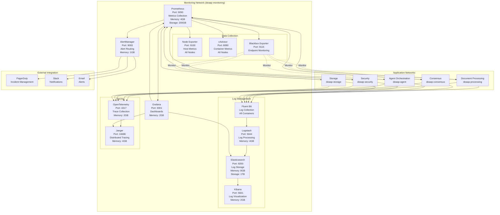

### Monitoring Data Flow

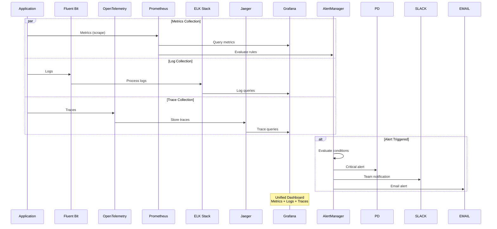

---

## Network Architecture Overview

### Complete Network Topology

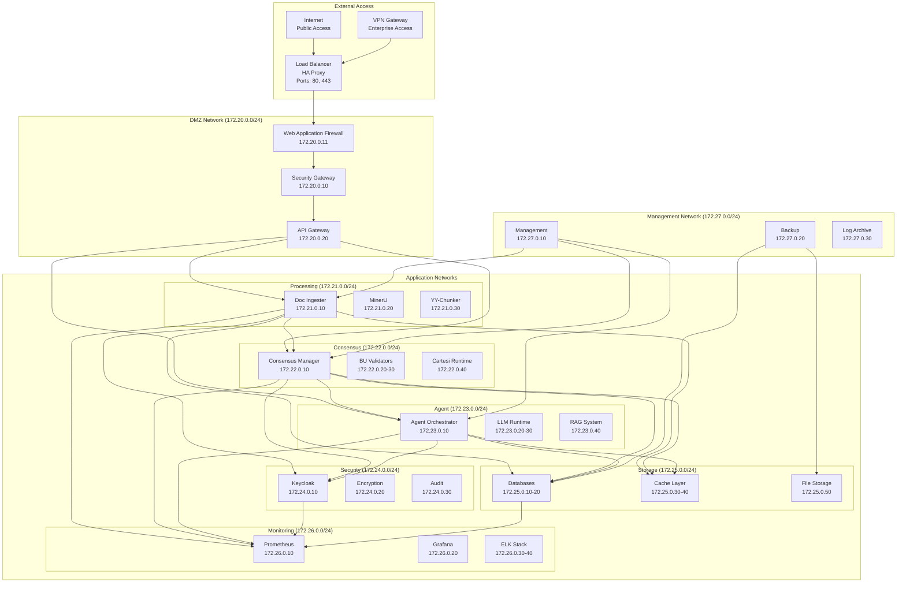

### Network Security Rules

| Source Network | Destination Network | Ports | Protocol | Purpose |
|----------------|-------------------|-------|----------|---------|
| DMZ | Processing | 8752-8758 | HTTPS | Document APIs |
| DMZ | Consensus | 8760-8770 | HTTPS/WSS | Consensus APIs |
| DMZ | Agent | 8770-8790 | HTTPS/WSS | Agent APIs |
| Processing | Consensus | 8760 | HTTPS | Validation requests |
| Consensus | Agent | 8770 | HTTPS | Authorization |
| All Apps | Security | 8800-8822 | HTTPS | Security services |
| All Apps | Storage | 5432, 6379, 8200 | TCP | Database access |
| All Apps | Monitoring | 9090-9093 | HTTP | Metrics collection |
| Management | All | 22, 3000-9999 | SSH/HTTP | Administration |

---

## Container Resource Requirements Summary

### Minimum Hardware Requirements

| Environment | CPU Cores | Memory (GB) | Storage (GB) | GPU |
|-------------|-----------|-------------|--------------|-----|
| Development | 16 | 64 | 500 | 1x RTX 3080 or better |
| Staging | 32 | 128 | 2000 | 2x RTX 4090 or better |
| Production | 64 | 256 | 5000 | 4x H100 or better |

### Container Resource Allocation

| Service Category | Containers | Total CPU | Total Memory | Total Storage |
|------------------|------------|-----------|--------------|---------------|
| Document Processing | 6 | 20 cores | 40 GB | 60 GB |
| Consensus & Blockchain | 8 | 24 cores | 44 GB | 220 GB |
| AI Agent Orchestration | 10 | 22 cores | 72 GB | 2.7 TB |
| Security & Privacy | 9 | 18 cores | 27 GB | 10 GB |
| Data Storage | 12 | 18 cores | 72 GB | 8.5 TB |
| Monitoring & Observability | 10 | 16 cores | 31 GB | 1.2 TB |
| **Total** | **55** | **118 cores** | **286 GB** | **12.5 TB** |

---

## Deployment Orchestration

### Docker Compose Profiles

```yaml
# docker-compose.yml profile structure
profiles:
  - development:  # Minimal services for local development
    - doc-ingester, mineru, yy-chunker
    - mock-consensus, mock-blockchain
    - basic-monitoring
    
  - staging:      # Full services with reduced resources
    - All processing services
    - Real consensus with 3 validators
    - Complete monitoring stack
    
  - production:   # Full services with HA
    - All services with clustering
    - Real consensus with 5+ validators
    - Complete security stack
    - Full monitoring and backup
```

### Health Check Dependencies

```mermaid
graph TB
    subgraph "Startup Order"
        L1[Layer 1: Infrastructure<br/>Networks, Volumes, Secrets]
        L2[Layer 2: Storage<br/>PostgreSQL, Redis, Vector DB]
        L3[Layer 3: Security<br/>Keycloak, Encryption, Audit]
        L4[Layer 4: Core Services<br/>Doc Ingester, Consensus, Blockchain]
        L5[Layer 5: Processing<br/>MinerU, YY-Chunker, Generators]
        L6[Layer 6: AI Services<br/>Agent Orchestrator, LLM Runtime]
        L7[Layer 7: Interface<br/>API Gateway, Web UI, Monitoring]
    end
    
    L1 --> L2
    L2 --> L3
    L3 --> L4
    L4 --> L5
    L5 --> L6
    L6 --> L7
    
    class L1 fill:#e1f5fe
    class L2 fill:#f3e5f5
    class L3 fill:#e8f5e8
    class L4 fill:#fff3e0
    class L5 fill:#fce4ec
    class L6 fill:#f1f8e9
    class L7 fill:#e8eaf6
```

This comprehensive container interaction documentation provides the visual architecture diagrams needed to complete your DEAAP system design. Each subsystem diagram shows the specific container interactions, resource requirements, and network topology required for a production-ready deployment.

The diagrams integrate seamlessly with your existing microservices documentation, security specifications, and operational frameworks, providing the final piece needed for a complete enterprise AI agent platform architecture.
