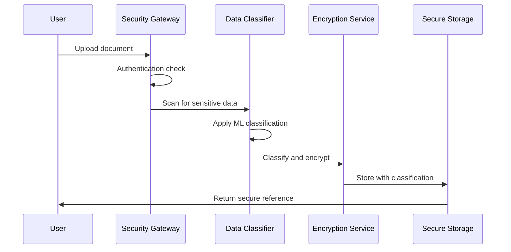
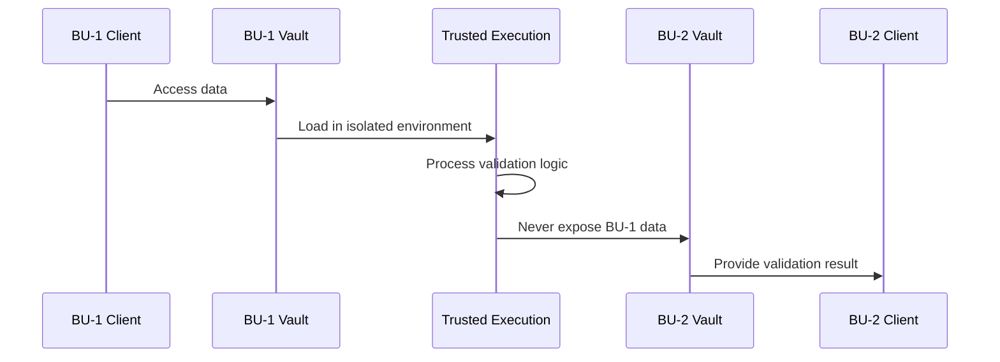

# System Design Specification 4: Data Security & Privacy

## Overview

This specification defines the comprehensive security and privacy architecture for DEAAP, ensuring data protection, access control, encryption, and compliance with enterprise security standards.

## Component Architecture

```mermaid
graph TD
    subgraph "Identity & Access Management"
        IAM[Identity Provider]
        RBAC[Role-Based Access Control]
        MFA[Multi-Factor Authentication]
        JWT[JWT Token Service]
        IAM --> RBAC
        IAM --> MFA
        IAM --> JWT
    end
    
    subgraph "Encryption Layer"
        E2E[End-to-End Encryption]
        TLS[TLS/SSL Transport]
        KEK[Key Exchange & Management]
        HSM[Hardware Security Module]
        E2E --> KEK
        TLS --> KEK
        KEK --> HSM
    end
    
    subgraph "Data Classification"
        DC[Data Classifier]
        DLP[Data Loss Prevention]
        PS[Privacy Scanner]
        PIIDetect[PII Detection Engine]
        DC --> DLP
        DC --> PS
        PS --> PIIDetect
    end
    
    subgraph "Audit & Compliance"
        AL[Audit Logger]
        CM[Compliance Monitor]
        RT[Real-time Alerting]
        FR[Forensic Recorder]
        AL --> CM
        CM --> RT
        AL --> FR
    end
    
    subgraph "Network Security"
        FW[Service Firewall]
        IDS[Intrusion Detection]
        VPN[Zero-Trust VPN]
        SN[Service Network Isolation]
        FW --> IDS
        VPN --> SN
        IDS --> RT
    end
    
    subgraph "Data Isolation"
        BUVault[BU Data Vaults]
        TEE[Trusted Execution Environment]
        SC[Secure Containers]
        DM[Data Masking]
        BUVault --> TEE
        TEE --> SC
        SC --> DM
    end
    
    class IAM,RBAC,MFA,JWT fill:#e8f5e8
    class E2E,TLS,KEK,HSM fill:#e1f5fe
    class DC,DLP,PS,PIIDetect fill:#f3e5f5
    class AL,CM,RT,FR fill:#fff3e0
    class FW,IDS,VPN,SN fill:#ffebee
    class BUVault,TEE,SC,DM fill:#f1f8e9
```



## Security Principles

### 1. Zero-Trust Architecture
- Never trust, always verify
- Micro-segmentation between services
- Continuous authentication and authorization

### 2. Defense in Depth
- Multiple layers of security controls
- Fail-safe defaults
- Principle of least privilege

### 3. Privacy by Design
- Data minimization
- Purpose limitation
- Transparency and control

### 4. Multi-Tenant Isolation
- Strong BU data isolation
- Cryptographic tenant boundaries
- Secure multi-party computation

## Container Specifications

### 1. Identity & Access Management (`iam-service`)

**Base Image**: `keycloak/keycloak:23.0`

**Ports**:
- `8080:8080` (IAM Console)
- `8443:8443` (HTTPS IAM)

**Volumes**:
- `./security/iam/themes:/opt/keycloak/themes`
- `./security/iam/providers:/opt/keycloak/providers`
- `./security/certificates:/opt/keycloak/certs`

**Environment Variables**:
```env
KEYCLOAK_ADMIN=admin
KEYCLOAK_ADMIN_PASSWORD=${IAM_ADMIN_PASSWORD}
KC_DB=postgres
KC_DB_URL=jdbc:postgresql://postgres:5432/keycloak
KC_DB_USERNAME=keycloak
KC_DB_PASSWORD=${KEYCLOAK_DB_PASSWORD}
KC_HOSTNAME=iam.deaap.local
KC_HTTPS_CERTIFICATE_FILE=/opt/keycloak/certs/tls.crt
KC_HTTPS_CERTIFICATE_KEY_FILE=/opt/keycloak/certs/tls.key
```

**Dependencies**:
- PostgreSQL (user/session storage)
- Redis (session cache)

### 2. Encryption Gateway (`encryption-gateway`)

**Base Image**: `python:3.11-slim`

**Ports**:
- `8765:8765` (Encryption API)

**Volumes**:
- `./services/encryption-gateway:/app`
- `./security/keys:/app/keys:ro`
- `./security/hsm:/app/hsm:ro`

**Environment Variables**:
```env
ENCRYPTION_PROVIDER=hsm
HSM_PKCS11_MODULE=/app/hsm/libpkcs11.so
KEY_ROTATION_INTERVAL=86400
ALGORITHM_PREFERENCE=AES-256-GCM
KDF_ITERATIONS=100000
SECURE_ENCLAVE_ENABLED=true
```

**Security Features**:
- Hardware-based key storage
- Automatic key rotation
- Secure key derivation
- Memory protection

### 3. Data Loss Prevention (`dlp-service`)

**Base Image**: `python:3.11-slim`

**Ports**:
- `8766:8766` (DLP API)

**Volumes**:
- `./services/dlp-service:/app`
- `./security/rules:/app/rules`
- `./data/quarantine:/app/quarantine`

**Environment Variables**:
```env
DLP_POLICY_ENGINE=regex_ml
PII_DETECTION_THRESHOLD=0.85
QUARANTINE_ENABLED=true
REAL_TIME_SCANNING=true
ML_MODEL_PATH=/app/models/pii_detection
ANONYMIZATION_STRATEGY=differential_privacy
```

**Detection Capabilities**:
- PII pattern recognition
- Machine learning classification
- Custom business rules
- Real-time data scanning

### 4. Audit Service (`audit-service`)

**Base Image**: `elasticsearch/elasticsearch:8.11.0`

**Ports**:
- `9200:9200` (Elasticsearch API)
- `9300:9300` (Transport)

**Volumes**:
- `./security/audit/data:/usr/share/elasticsearch/data`
- `./security/audit/config:/usr/share/elasticsearch/config`
- `./security/certificates:/usr/share/elasticsearch/config/certs`

**Environment Variables**:
```env
discovery.type=single-node
xpack.security.enabled=true
xpack.security.http.ssl.enabled=true
xpack.security.transport.ssl.enabled=true
xpack.security.http.ssl.certificate=/usr/share/elasticsearch/config/certs/tls.crt
xpack.security.http.ssl.key=/usr/share/elasticsearch/config/certs/tls.key
ELASTIC_PASSWORD=${ELASTICSEARCH_PASSWORD}
```

**Audit Features**:
- Immutable audit logs
- Real-time alerting
- Compliance reporting
- Forensic analysis

### 5. Network Security (`network-security`)

**Base Image**: `alpine:3.18`

**Ports**:
- `8767:8767` (Security API)

**Volumes**:
- `./security/network/policies:/app/policies`
- `./security/network/logs:/app/logs`

**Environment Variables**:
```env
FIREWALL_MODE=strict
INTRUSION_DETECTION=enabled
ZERO_TRUST_VERIFICATION=required
NETWORK_SEGMENTATION=micro
RATE_LIMITING_ENABLED=true
```

## Data Classification & Handling

### Classification Levels

#### 1. Public Data
- **Definition**: Information intended for public consumption
- **Handling**: Standard encryption in transit
- **Access Control**: Authenticated users
- **Retention**: Indefinite

#### 2. Internal Use
- **Definition**: Business information for internal operations
- **Handling**: Encryption at rest and in transit
- **Access Control**: Role-based, need-to-know
- **Retention**: Business requirements

#### 3. Confidential
- **Definition**: Sensitive business information
- **Handling**: Strong encryption, access logging
- **Access Control**: Explicit authorization required
- **Retention**: Limited, automatic purging

#### 4. Restricted
- **Definition**: Highly sensitive, regulated data
- **Handling**: Maximum security controls
- **Access Control**: Multi-factor authentication
- **Retention**: Minimal, immediate destruction

### Data Handling Workflows

#### 1. Data Ingestion Security


#### 2. BU Data Isolation


## Encryption Architecture

### 1. Key Management Hierarchy

#### Master Keys
- **Storage**: Hardware Security Module (HSM)
- **Purpose**: Encrypt data encryption keys
- **Rotation**: Annual or on compromise
- **Access**: Split knowledge, dual control

#### Data Encryption Keys (DEK)
- **Storage**: Encrypted by master keys
- **Purpose**: Encrypt actual data
- **Rotation**: Monthly or on access pattern change
- **Scope**: Per-tenant, per-classification

#### Transport Keys
- **Storage**: Ephemeral, in-memory
- **Purpose**: TLS/SSL communications
- **Rotation**: Per-session
- **Generation**: Perfect Forward Secrecy

### 2. Encryption Algorithms

#### Data at Rest
- **Algorithm**: AES-256-GCM
- **Key Derivation**: PBKDF2 with 100,000 iterations
- **Salt**: Unique per encryption operation
- **Authentication**: Integrated with GCM mode

#### Data in Transit
- **Protocol**: TLS 1.3
- **Cipher Suites**: ECDHE-ECDSA-AES256-GCM-SHA384
- **Certificate**: ECDSA P-384
- **HSTS**: Enforced with long max-age

#### Data in Processing
- **Environment**: Intel SGX or ARM TrustZone
- **Memory**: Encrypted RAM regions
- **Attestation**: Remote verification
- **Side-channel**: Constant-time algorithms

## Access Control Framework

### 1. Role-Based Access Control (RBAC)

#### System Roles
```yaml
Administrator:
  permissions:
    - system:admin
    - data:*
    - user:manage
  scope: global

BU_Manager:
  permissions:
    - data:read:own_bu
    - data:write:own_bu
    - validation:participate
  scope: business_unit

Data_Scientist:
  permissions:
    - data:read:authorized
    - model:create
    - agent:deploy:limited
  scope: department

Auditor:
  permissions:
    - audit:read
    - compliance:report
  scope: read_only
```

#### Attribute-Based Access Control (ABAC)
```yaml
policy_example:
  effect: allow
  condition:
    - user.role == "Data_Scientist"
    - data.classification <= "Confidential"
    - user.bu == data.source_bu OR consensus.approved == true
    - time.hour >= 9 AND time.hour <= 17
    - user.mfa_verified == true
```

### 2. Dynamic Authorization

#### Context-Aware Decisions
- **User attributes**: Role, department, clearance level
- **Resource attributes**: Classification, owner, age
- **Environmental attributes**: Time, location, device
- **Risk score**: Behavioral analysis, threat intelligence

#### Real-time Policy Enforcement
```python
def evaluate_access_request(user, resource, action, context):
    """
    Real-time authorization decision engine
    """
    risk_score = calculate_risk_score(user, context)
    
    if risk_score > HIGH_RISK_THRESHOLD:
        return DENY_REQUIRE_ADDITIONAL_AUTH
    
    if resource.classification == RESTRICTED:
        return require_consensus_approval(user, resource)
    
    return apply_rbac_policy(user, resource, action)
```

## Privacy Protection Mechanisms

### 1. Data Minimization

#### Collection Principles
- **Purpose limitation**: Collect only necessary data
- **Storage limitation**: Retain only as long as needed
- **Use limitation**: Use only for declared purposes
- **Accuracy**: Maintain data quality and currency

#### Implementation
```python
class DataMinimizer:
    def __init__(self):
        self.retention_policies = load_retention_policies()
        self.purpose_tracker = PurposeTracker()
    
    def process_document(self, document, purpose):
        # Extract only relevant information
        relevant_data = self.extract_relevant(document, purpose)
        
        # Set expiration based on purpose
        expiration = self.calculate_expiration(purpose)
        
        # Apply privacy controls
        return self.apply_privacy_controls(relevant_data, purpose, expiration)
```

### 2. Differential Privacy

#### Noise Addition
- **Mechanism**: Laplace noise for numerical data
- **Epsilon**: Privacy budget per query (ε ≤ 1.0)
- **Delta**: Probability of privacy violation (δ ≤ 10^-6)
- **Composition**: Track cumulative privacy loss

#### Implementation
```python
class DifferentialPrivacy:
    def __init__(self, epsilon=0.1, delta=1e-6):
        self.epsilon = epsilon
        self.delta = delta
        self.privacy_budget = PrivacyBudget(epsilon, delta)
    
    def add_noise(self, value, sensitivity):
        if not self.privacy_budget.can_spend(self.epsilon):
            raise PrivacyBudgetExceeded()
        
        noise = np.random.laplace(0, sensitivity / self.epsilon)
        self.privacy_budget.spend(self.epsilon)
        return value + noise
```

### 3. Secure Multi-Party Computation

#### BU Data Sharing
```python
class SecureMultiPartyComputation:
    def __init__(self, parties):
        self.parties = parties
        self.secret_sharing = SecretSharing()
    
    def collaborative_validation(self, bu_data_sets):
        """
        Validate data usage without revealing individual BU data
        """
        # Share secrets among parties
        shared_secrets = {}
        for bu_id, data in bu_data_sets.items():
            shared_secrets[bu_id] = self.secret_sharing.share(
                data, threshold=len(self.parties) // 2 + 1
            )
        
        # Compute validation result without revealing inputs
        validation_result = self.compute_validation(shared_secrets)
        
        return validation_result
```

## Compliance Framework

### 1. Regulatory Compliance

#### GDPR Compliance
- **Data subject rights**: Access, rectification, erasure, portability
- **Lawful basis**: Legitimate interest, consent, contract
- **Privacy by design**: Default privacy settings
- **Data protection impact assessments**: Automated evaluation

#### CCPA Compliance
- **Consumer rights**: Know, delete, opt-out, non-discrimination
- **Business purpose**: Documented and limited
- **Third-party sharing**: Explicit consent required
- **Verification**: Identity verification for requests

#### SOX Compliance
- **Financial data protection**: Enhanced controls for financial information
- **Audit trails**: Immutable logging of all financial data access
- **Segregation of duties**: Multiple approval requirements
- **Regular testing**: Automated compliance testing

### 2. Industry Standards

#### ISO 27001
- **Information Security Management System**: Systematic approach
- **Risk assessment**: Regular vulnerability assessments
- **Incident response**: Automated incident detection and response
- **Continuous improvement**: Regular security reviews

#### NIST Framework
- **Identify**: Asset inventory and risk assessment
- **Protect**: Access controls and data protection
- **Detect**: Continuous monitoring and anomaly detection
- **Respond**: Incident response procedures
- **Recover**: Business continuity and disaster recovery

## Monitoring & Incident Response

### 1. Security Monitoring

#### Real-time Threat Detection
```yaml
detection_rules:
  - name: "Suspicious data access pattern"
    condition: "access_count > 100 in 5m AND user.risk_score > 0.8"
    action: "alert_security_team"
    severity: "high"
  
  - name: "Privilege escalation attempt"
    condition: "permission_change AND user.role != 'Administrator'"
    action: "block_immediately"
    severity: "critical"
  
  - name: "Data exfiltration indicator"
    condition: "data_transfer > 10GB AND destination == external"
    action: "require_additional_approval"
    severity: "medium"
```

#### Behavioral Analytics
```python
class BehaviorAnalytics:
    def __init__(self):
        self.ml_model = load_behavioral_model()
        self.baseline_profiles = load_user_baselines()
    
    def analyze_user_behavior(self, user_id, current_activity):
        baseline = self.baseline_profiles[user_id]
        risk_score = self.ml_model.predict_risk(
            baseline, current_activity
        )
        
        if risk_score > ANOMALY_THRESHOLD:
            return create_security_alert(user_id, risk_score, current_activity)
        
        return None
```

### 2. Incident Response

#### Automated Response
```python
class IncidentResponse:
    def __init__(self):
        self.response_playbooks = load_response_playbooks()
        self.escalation_matrix = load_escalation_matrix()
    
    def handle_security_incident(self, incident):
        severity = self.classify_incident(incident)
        playbook = self.response_playbooks[incident.type]
        
        # Immediate automated response
        if severity >= CRITICAL:
            self.isolate_affected_systems(incident.affected_systems)
            self.notify_security_team(incident, urgent=True)
        
        # Execute response playbook
        for step in playbook.steps:
            result = self.execute_response_step(step, incident)
            self.log_response_action(step, result)
        
        return self.generate_incident_report(incident, playbook)
```

#### Forensic Analysis
```python
class ForensicAnalysis:
    def __init__(self):
        self.evidence_collector = EvidenceCollector()
        self.timeline_reconstructor = TimelineReconstructor()
    
    def investigate_incident(self, incident_id):
        # Collect digital evidence
        evidence = self.evidence_collector.collect_evidence(incident_id)
        
        # Reconstruct timeline
        timeline = self.timeline_reconstructor.build_timeline(evidence)
        
        # Analyze attack vectors
        attack_analysis = self.analyze_attack_vectors(evidence, timeline)
        
        return ForensicReport(evidence, timeline, attack_analysis)
```

## Security Testing & Validation

### 1. Penetration Testing

#### Automated Security Scanning
```yaml
security_tests:
  - name: "OWASP Top 10 Scan"
    frequency: "weekly"
    tools: ["OWASP ZAP", "Burp Suite"]
    scope: "all_web_services"
  
  - name: "Container Security Scan"
    frequency: "on_build"
    tools: ["Trivy", "Clair"]
    scope: "all_container_images"
  
  - name: "Network Penetration Test"
    frequency: "monthly"
    tools: ["Nmap", "Metasploit"]
    scope: "internal_network"
```

#### Red Team Exercises
```python
class RedTeamExercise:
    def __init__(self):
        self.attack_scenarios = load_attack_scenarios()
        self.blue_team_alerts = BlueTeamAlerts()
    
    def execute_attack_scenario(self, scenario):
        attack_plan = self.generate_attack_plan(scenario)
        
        for phase in attack_plan.phases:
            # Execute attack phase
            result = self.execute_attack_phase(phase)
            
            # Monitor blue team response
            blue_team_response = self.blue_team_alerts.get_response(phase)
            
            # Document findings
            self.document_findings(phase, result, blue_team_response)
        
        return self.generate_exercise_report(scenario, attack_plan)
```

### 2. Security Metrics

#### Key Performance Indicators
```yaml
security_kpis:
  detection_metrics:
    - mean_time_to_detection: "< 5 minutes"
    - false_positive_rate: "< 5%"
    - coverage_percentage: "> 95%"
  
  response_metrics:
    - mean_time_to_containment: "< 15 minutes"
    - mean_time_to_recovery: "< 4 hours"
    - incident_recurrence_rate: "< 2%"
  
  compliance_metrics:
    - policy_compliance_rate: "> 98%"
    - audit_finding_closure_time: "< 30 days"
    - training_completion_rate: "> 95%"
```

This comprehensive security and privacy specification ensures that DEAAP maintains the highest standards of data protection while enabling secure collaboration across multiple Business Units.
