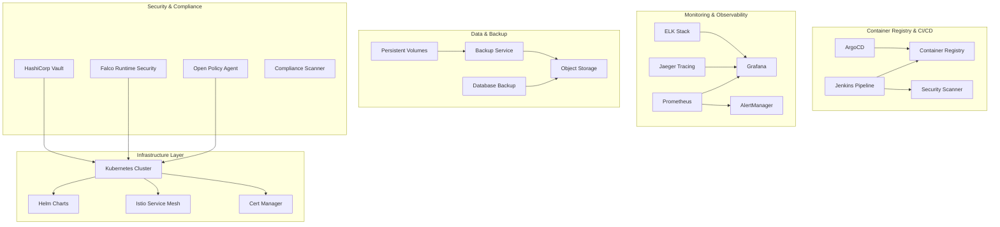
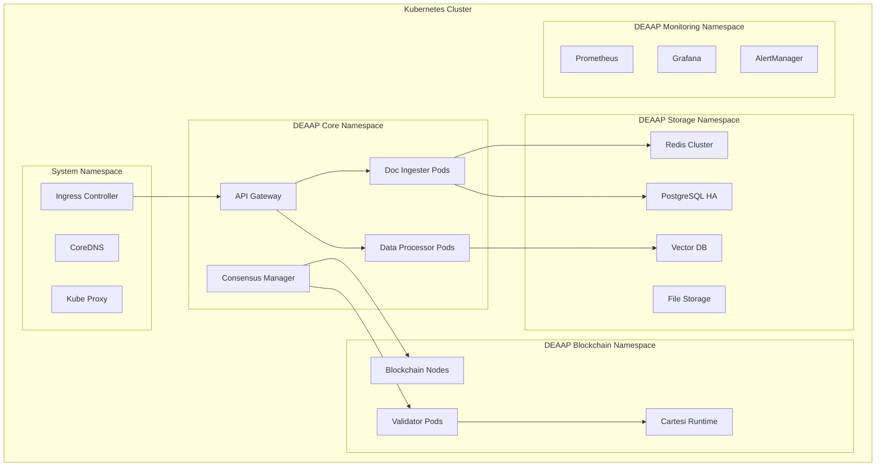
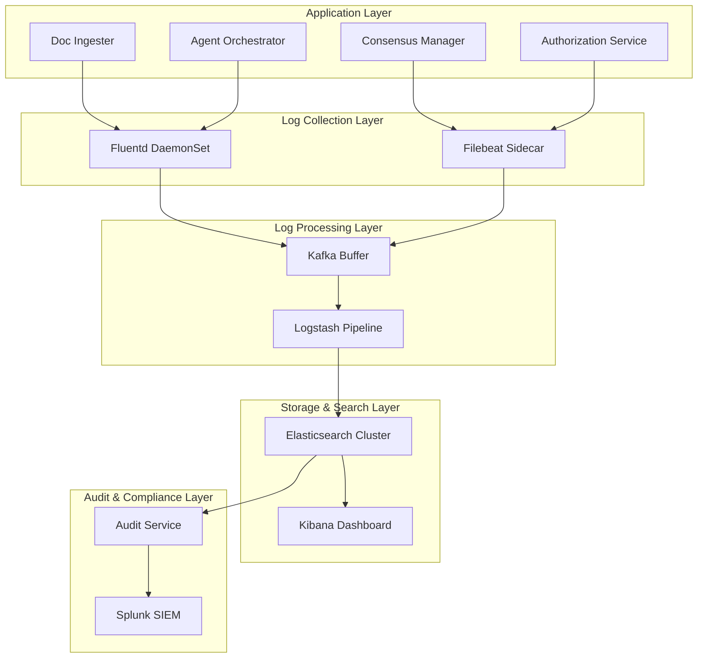

# System Design Specification 5: Operations & Deployment

## Overview

This specification defines the operational architecture, deployment strategies, monitoring frameworks, and DevOps practices for the Decentralized Enterprise AI Agent Platform (DEAAP). It covers multi-environment deployments, service orchestration, monitoring, logging, backup/recovery, and operational procedures.

## Component Architecture



## Deployment Environments

### 1. Development Environment

**Purpose**: Local development and testing
**Scale**: Single-node deployment
**Infrastructure**: Docker Compose

```yaml
# docker-compose.dev.yml
version: '3.8'
services:
  # Core services with minimal resources
  doc-ingester:
    image: deaap/doc-ingester:dev
    ports: ["8752:8752"]
    environment:
      - REDIS_URL=redis://redis:6379
      - POSTGRES_URL=postgresql://postgres:5432/deaap_dev
    volumes:
      - ./data/dev:/app/data
    profiles: ["development"]
  
  mineru:
    image: deaap/mineru:dev
    runtime: nvidia
    environment:
      - CUDA_VISIBLE_DEVICES=0
    profiles: ["development"]
  
  # Mock services for rapid development
  mock-consensus:
    image: deaap/mock-consensus:dev
    ports: ["8760:8760"]
    profiles: ["development"]
```

### 2. Staging Environment

**Purpose**: Integration testing and validation
**Scale**: Multi-node, production-like
**Infrastructure**: Kubernetes

```yaml
# staging-values.yaml
global:
  environment: staging
  resources:
    requests:
      memory: "1Gi"
      cpu: "500m"
    limits:
      memory: "2Gi"  
      cpu: "1"

docIngester:
  replicaCount: 2
  autoscaling:
    enabled: true
    minReplicas: 2
    maxReplicas: 10

blockchain:
  persistence:
    enabled: true
    size: 100Gi
  
consensus:
  validators: 3
  testMode: true
```

### 3. Production Environment

**Purpose**: Live enterprise deployment
**Scale**: High-availability, auto-scaling
**Infrastructure**: Kubernetes with full monitoring

```yaml
# production-values.yaml
global:
  environment: production
  resources:
    requests:
      memory: "2Gi"
      cpu: "1"
    limits:
      memory: "8Gi"
      cpu: "4"

docIngester:
  replicaCount: 5
  autoscaling:
    enabled: true
    minReplicas: 5
    maxReplicas: 50
    targetCPUUtilizationPercentage: 70

blockchain:
  persistence:
    enabled: true
    size: 1Ti
    storageClass: fast-ssd
  
consensus:
  validators: 7
  productionMode: true
  
security:
  networkPolicies:
    enabled: true
  podSecurityPolicies:
    enabled: true
```

## Container Orchestration

### Kubernetes Deployment Architecture



### Service Mesh Configuration

```yaml
# istio-config.yaml
apiVersion: networking.istio.io/v1beta1
kind: VirtualService
metadata:
  name: deaap-gateway
spec:
  hosts:
  - deaap.company.com
  gateways:
  - deaap-gateway
  http:
  - match:
    - uri:
        prefix: "/api/v1/documents"
    route:
    - destination:
        host: doc-ingester-service
        port:
          number: 8752
  - match:
    - uri:
        prefix: "/api/v1/consensus"
    route:
    - destination:
        host: consensus-manager-service
        port:
          number: 8760
```

## Monitoring & Observability

### Prometheus Monitoring Stack

```yaml
# monitoring-stack.yaml
prometheus:
  prometheusSpec:
    retention: 30d
    storageSpec:
      volumeClaimTemplate:
        spec:
          storageClassName: fast-ssd
          resources:
            requests:
              storage: 500Gi
    
    additionalScrapeConfigs:
    - job_name: 'deaap-services'
      kubernetes_sd_configs:
      - role: pod
      relabel_configs:
      - source_labels: [__meta_kubernetes_pod_annotation_prometheus_io_scrape]
        action: keep
        regex: true

grafana:
  persistence:
    enabled: true
    size: 10Gi
  
  dashboardProviders:
    dashboardproviders.yaml:
      apiVersion: 1
      providers:
      - name: 'deaap-dashboards'
        folder: 'DEAAP'
        type: file
        options:
          path: /var/lib/grafana/dashboards/deaap
```

### Key Performance Indicators (KPIs)

```yaml
# Custom metrics for DEAAP
deaap_document_processing_duration_seconds:
  type: histogram
  description: "Time taken to process documents"
  labels: ["service", "document_type", "chunk_method"]

deaap_consensus_validation_success_rate:
  type: gauge
  description: "Percentage of successful validations"
  labels: ["bu_name", "validator_id"]

deaap_agent_deployment_count:
  type: counter
  description: "Number of AI agents deployed"
  labels: ["bu_name", "agent_type", "status"]

deaap_blockchain_transaction_count:
  type: counter
  description: "Number of blockchain transactions"
  labels: ["contract", "function", "status"]
```

### Alerting Rules

```yaml
# alerting-rules.yaml
groups:
- name: deaap.rules
  rules:
  - alert: DocIngesterHighLatency
    expr: histogram_quantile(0.95, deaap_document_processing_duration_seconds) > 300
    for: 5m
    labels:
      severity: warning
    annotations:
      summary: "Document processing latency is high"
      
  - alert: ConsensusValidationFailure
    expr: deaap_consensus_validation_success_rate < 0.8
    for: 2m
    labels:
      severity: critical
    annotations:
      summary: "Consensus validation success rate below threshold"
      
  - alert: BlockchainNodeDown
    expr: up{job="blockchain-node"} == 0
    for: 1m
    labels:
      severity: critical
    annotations:
      summary: "Blockchain node is down"
```

## Logging & Audit Trail

### Centralized Logging Architecture



### Log Format Standardization

```json
{
  "timestamp": "2024-01-15T10:30:00.000Z",
  "level": "INFO",
  "service": "doc-ingester",
  "pod": "doc-ingester-74f8c9b5d-xyz123",
  "namespace": "deaap-core",
  "trace_id": "1234567890abcdef",
  "span_id": "abcdef1234567890",
  "user_id": "user@company.com",
  "bu_name": "finance",
  "operation": "document_processing",
  "document_id": "doc_123456",
  "message": "Document processing completed successfully",
  "duration_ms": 2500,
  "metadata": {
    "document_type": "pdf",
    "chunk_method": "CLUSTER_SEMANTIC",
    "chunk_count": 15,
    "file_size_bytes": 2048576
  }
}
```

## Backup & Disaster Recovery

### Backup Strategy

```yaml
# backup-cronjob.yaml
apiVersion: batch/v1
kind: CronJob
metadata:
  name: deaap-backup
spec:
  schedule: "0 2 * * *"  # Daily at 2 AM
  jobTemplate:
    spec:
      template:
        spec:
          containers:
          - name: backup-runner
            image: deaap/backup-service:latest
            env:
            - name: BACKUP_TYPE
              value: "full"
            - name: S3_BUCKET
              value: "deaap-backups"
            - name: RETENTION_DAYS
              value: "30"
            command:
            - /scripts/backup.sh
            volumeMounts:
            - name: data-volume
              mountPath: /data
```

### Disaster Recovery Procedures

```bash
#!/bin/bash
# disaster-recovery.sh

set -e

echo "Starting DEAAP disaster recovery process..."

# 1. Restore blockchain state
kubectl apply -f restore/blockchain-restore.yaml
kubectl wait --for=condition=Ready pod/blockchain-restore --timeout=600s

# 2. Restore databases
kubectl exec -it postgres-restore -- psql -f /backup/postgres_dump.sql
kubectl exec -it redis-restore -- redis-cli --rdb /backup/redis_dump.rdb

# 3. Restore application data
kubectl apply -f restore/storage-restore.yaml

# 4. Restart services in dependency order
kubectl rollout restart deployment/consensus-manager
kubectl rollout restart deployment/doc-ingester
kubectl rollout restart deployment/agent-orchestrator

# 5. Verify system health
./scripts/health-check.sh

echo "Disaster recovery completed successfully"
```

## Security Operations

### Secret Management

```yaml
# vault-config.yaml
apiVersion: v1
kind: ConfigMap
metadata:
  name: vault-config
data:
  vault.hcl: |
    storage "consul" {
      address = "consul:8500"
      path = "vault/"
    }
    
    listener "tcp" {
      address = "0.0.0.0:8200"
      tls_disable = 1
    }
    
    seal "gcpckms" {
      project     = "deaap-production"
      region      = "us-central1"
      key_ring    = "vault-seal"
      crypto_key  = "vault-key"
    }
```

### Runtime Security

```yaml
# falco-rules.yaml
- rule: DEAAP Unauthorized File Access
  desc: Detect unauthorized access to DEAAP data files
  condition: >
    open_read and
    fd.directory contains "/app/data" and
    not proc.name in (doc-ingester, data-processor, backup-service)
  output: >
    Unauthorized access to DEAAP data
    (user=%user.name proc=%proc.name file=%fd.name)
  priority: WARNING

- rule: DEAAP Consensus Tampering
  desc: Detect potential consensus tampering
  condition: >
    proc.name contains "consensus" and
    (modify or open_write) and
    fd.name contains "validation"
  output: >
    Potential consensus tampering detected
    (user=%user.name proc=%proc.name file=%fd.name)
  priority: CRITICAL
```

## Deployment Automation

### CI/CD Pipeline

```yaml
# .github/workflows/deploy.yml
name: DEAAP Deployment Pipeline

on:
  push:
    branches: [main, develop]
  pull_request:
    branches: [main]

jobs:
  test:
    runs-on: ubuntu-latest
    steps:
    - uses: actions/checkout@v3
    - name: Run unit tests
      run: |
        docker compose -f docker-compose.test.yml up --abort-on-container-exit
    
    - name: Run integration tests
      run: |
        ./scripts/run-integration-tests.sh
  
  security-scan:
    runs-on: ubuntu-latest
    steps:
    - uses: actions/checkout@v3
    - name: Container security scan
      uses: aquasecurity/trivy-action@master
      with:
        scan-type: 'fs'
        scan-ref: '.'
  
  deploy-staging:
    needs: [test, security-scan]
    if: github.ref == 'refs/heads/develop'
    runs-on: ubuntu-latest
    steps:
    - name: Deploy to staging
      run: |
        helm upgrade --install deaap-staging ./helm/deaap \
          -f helm/values-staging.yaml \
          --namespace deaap-staging
  
  deploy-production:
    needs: [test, security-scan]
    if: github.ref == 'refs/heads/main'
    runs-on: ubuntu-latest
    steps:
    - name: Deploy to production
      run: |
        helm upgrade --install deaap-production ./helm/deaap \
          -f helm/values-production.yaml \
          --namespace deaap-production
```

### Helm Chart Structure

```
helm/deaap/
├── Chart.yaml
├── values.yaml
├── values-staging.yaml
├── values-production.yaml
├── templates/
│   ├── deployment.yaml
│   ├── service.yaml
│   ├── ingress.yaml
│   ├── configmap.yaml
│   ├── secret.yaml
│   ├── persistent-volume.yaml
│   └── hpa.yaml
├── charts/
│   ├── postgresql/
│   ├── redis/
│   └── prometheus/
└── crds/
    └── consensus-validator.yaml
```

## Performance Optimization

### Resource Management

```yaml
# resource-quotas.yaml
apiVersion: v1
kind: ResourceQuota
metadata:
  name: deaap-quota
  namespace: deaap-core
spec:
  hard:
    requests.cpu: "20"
    requests.memory: 40Gi
    limits.cpu: "40"
    limits.memory: 80Gi
    persistentvolumeclaims: "10"
    count/pods: "50"
```

### Auto-scaling Configuration

```yaml
# horizontal-pod-autoscaler.yaml
apiVersion: autoscaling/v2
kind: HorizontalPodAutoscaler
metadata:
  name: doc-ingester-hpa
spec:
  scaleTargetRef:
    apiVersion: apps/v1
    kind: Deployment
    name: doc-ingester
  minReplicas: 3
  maxReplicas: 20
  metrics:
  - type: Resource
    resource:
      name: cpu
      target:
        type: Utilization
        averageUtilization: 70
  - type: Resource
    resource:
      name: memory
      target:
        type: Utilization
        averageUtilization: 80
  - type: Pods
    pods:
      metric:
        name: document_processing_queue_size
      target:
        type: AverageValue
        averageValue: "10"
```

## Operational Procedures

### Health Check Scripts

```bash
#!/bin/bash
# health-check.sh

echo "Performing DEAAP system health check..."

# Check all pods are running
echo "Checking pod status..."
kubectl get pods -n deaap-core -o wide

# Check service endpoints
echo "Checking service endpoints..."
services=("doc-ingester" "consensus-manager" "agent-orchestrator" "authorization")
for service in "${services[@]}"; do
  endpoint="http://${service}.deaap-core.svc.cluster.local:8080/health"
  if curl -f -s "$endpoint" > /dev/null; then
    echo "✅ $service is healthy"
  else
    echo "❌ $service is unhealthy"
  fi
done

# Check blockchain connectivity
echo "Checking blockchain connectivity..."
kubectl exec -n deaap-blockchain blockchain-0 -- curl -f http://localhost:8545

# Check database connectivity
echo "Checking database connectivity..."
kubectl exec -n deaap-storage postgres-0 -- pg_isready

echo "Health check completed"
```

### Scaling Procedures

```bash
#!/bin/bash
# scale-services.sh

ENVIRONMENT=${1:-staging}
SCALE_FACTOR=${2:-2}

echo "Scaling DEAAP services in $ENVIRONMENT by factor $SCALE_FACTOR"

# Scale core processing services
kubectl scale deployment doc-ingester --replicas=$((3 * SCALE_FACTOR)) -n deaap-$ENVIRONMENT
kubectl scale deployment data-processor --replicas=$((2 * SCALE_FACTOR)) -n deaap-$ENVIRONMENT
kubectl scale deployment agent-orchestrator --replicas=$((2 * SCALE_FACTOR)) -n deaap-$ENVIRONMENT

# Scale storage backends
kubectl scale statefulset redis --replicas=$((3 * SCALE_FACTOR)) -n deaap-$ENVIRONMENT
kubectl scale statefulset postgres --replicas=$((2 * SCALE_FACTOR)) -n deaap-$ENVIRONMENT

echo "Scaling completed. Waiting for rollout to finish..."
kubectl rollout status deployment/doc-ingester -n deaap-$ENVIRONMENT
kubectl rollout status deployment/data-processor -n deaap-$ENVIRONMENT
kubectl rollout status deployment/agent-orchestrator -n deaap-$ENVIRONMENT

echo "All services scaled successfully"
```

## Compliance & Audit

### Audit Trail Configuration

```yaml
# audit-policy.yaml
apiVersion: audit.k8s.io/v1
kind: Policy
rules:
- level: Metadata
  namespaces: ["deaap-core", "deaap-blockchain"]
  verbs: ["create", "update", "patch", "delete"]
  resources:
  - group: ""
    resources: ["pods", "services", "configmaps", "secrets"]
  - group: "apps"
    resources: ["deployments", "statefulsets"]

- level: RequestResponse
  namespaces: ["deaap-core"]
  verbs: ["create", "update", "patch"]
  resources:
  - group: ""
    resources: ["secrets"]
  - group: "deaap.io"
    resources: ["consensusvalidations", "agentdeployments"]
```

### Compliance Reporting

```python
# compliance-reporter.py
import json
import datetime
from kubernetes import client, config

class ComplianceReporter:
    def __init__(self):
        config.load_incluster_config()
        self.v1 = client.CoreV1Api()
        self.apps_v1 = client.AppsV1Api()
    
    def generate_compliance_report(self):
        report = {
            "timestamp": datetime.datetime.utcnow().isoformat(),
            "environment": "production",
            "checks": []
        }
        
        # Check for security policies
        report["checks"].append({
            "name": "Pod Security Standards",
            "status": self.check_pod_security_standards(),
            "details": "All pods must run with security context"
        })
        
        # Check for resource limits
        report["checks"].append({
            "name": "Resource Limits",
            "status": self.check_resource_limits(),
            "details": "All containers must have resource limits"
        })
        
        # Check for data encryption
        report["checks"].append({
            "name": "Data Encryption",
            "status": self.check_data_encryption(),
            "details": "All persistent volumes must be encrypted"
        })
        
        return report
    
    def check_pod_security_standards(self):
        # Implementation for security standards check
        return "COMPLIANT"
    
    def check_resource_limits(self):
        # Implementation for resource limits check
        return "COMPLIANT"
    
    def check_data_encryption(self):
        # Implementation for encryption check
        return "COMPLIANT"
```

## Performance Benchmarks

### Load Testing

```yaml
# load-test.yaml
apiVersion: v1
kind: ConfigMap
metadata:
  name: load-test-config
data:
  test-plan.jmx: |
    <?xml version="1.0" encoding="UTF-8"?>
    <jmeterTestPlan version="1.2">
      <TestPlan>
        <elementProp name="TestPlan.arguments" elementType="Arguments"/>
        <stringProp name="TestPlan.comments">DEAAP Load Test</stringProp>
        <boolProp name="TestPlan.functional_mode">false</boolProp>
        <boolProp name="TestPlan.tearDown_on_shutdown">true</boolProp>
        <boolProp name="TestPlan.serialize_threadgroups">false</boolProp>
        <stringProp name="TestPlan.user_define_classpath"></stringProp>
      </TestPlan>
      <!-- Document processing load test -->
      <ThreadGroup>
        <stringProp name="ThreadGroup.num_threads">100</stringProp>
        <stringProp name="ThreadGroup.ramp_time">60</stringProp>
        <stringProp name="ThreadGroup.duration">300</stringProp>
      </ThreadGroup>
    </jmeterTestPlan>
```

### Performance Targets

| Component | Metric | Target | Alert Threshold |
|-----------|--------|--------|-----------------|
| Doc Ingester | Processing Latency | < 30s per PDF | > 60s |
| Consensus Manager | Validation Time | < 5min per request | > 10min |
| Agent Orchestrator | Deployment Time | < 2min per agent | > 5min |
| Blockchain | Transaction Throughput | > 100 TPS | < 50 TPS |
| Vector Database | Query Latency | < 100ms | > 500ms |
| API Gateway | Request Latency | < 200ms | > 1s |

## Troubleshooting Guide

### Common Issues

#### 1. Document Processing Failures
```bash
# Check doc-ingester logs
kubectl logs -f deployment/doc-ingester -n deaap-core

# Check mineru service status
kubectl exec -it mineru-pod -- curl localhost:8753/health

# Restart processing pipeline
kubectl rollout restart deployment/doc-ingester
kubectl rollout restart deployment/data-processor
```

#### 2. Consensus Validation Issues
```bash
# Check validator node status
kubectl get pods -l app=bu-validator -o wide

# Check blockchain connectivity
kubectl exec -it consensus-manager -- curl blockchain:8545

# View consensus logs
kubectl logs -f deployment/consensus-manager -n deaap-blockchain
```

#### 3. Storage Issues
```bash
# Check persistent volume status
kubectl get pv -o wide

# Check storage class
kubectl get storageclass

# Verify database connectivity
kubectl exec -it postgres-0 -- psql -U deaap -c "SELECT 1"
```

## Summary

This operations and deployment specification provides:

1. **Multi-Environment Support**: Development, staging, and production configurations
2. **Container Orchestration**: Kubernetes-based deployment with Helm charts
3. **Monitoring & Observability**: Comprehensive monitoring stack with Prometheus, Grafana, and ELK
4. **Security Operations**: Vault integration, runtime security, and compliance monitoring
5. **Disaster Recovery**: Backup strategies and recovery procedures
6. **Performance Optimization**: Auto-scaling, resource management, and performance targets
7. **Operational Procedures**: Health checks, scaling, and troubleshooting guides

The architecture ensures DEAAP can be deployed reliably across different environments while maintaining security, performance, and operational excellence standards.
