# DEAAP Microservices Interactions Documentation

## Overview

This document details the interaction patterns, data flows, and communication protocols between all microservices in the Decentralized Enterprise AI Agent Platform (DEAAP).

## Service Map & Dependencies

```mermaid
graph TB
    subgraph "External Interface"
        User[👤 User]
        CLI[⚡ CLI Tools]
        WebUI[🌐 Web Interface]
    end
    
    subgraph "API Gateway Layer"
        Gateway[🚪 API Gateway]
        Auth[🔐 Auth Service]
        RateLimit[⏱️ Rate Limiter]
    end
    
    subgraph "Document Processing Pipeline"
        DocIngester[📄 Doc Ingester]
        MinerU[⚙️ MinerU Engine]
        YYChunker[✂️ YY-Chunker]
        SynthGen[🧬 Synthetic Generator]
        EmbedGen[🔢 Embedding Generator]
        LORAGen[🎯 LORA Generator]
    end
    
    subgraph "Consensus & Validation Layer"
        ConsensusMgr[🏛️ Consensus Manager]
        BlockchainNode[⛓️ Blockchain Node]
        ValidatorBU1[🏢 BU-1 Validator]
        ValidatorBU2[🏢 BU-2 Validator]
        ValidatorBUN[🏢 BU-N Validator]
        CartesiRuntime[🔮 Cartesi Runtime]
    end
    
    subgraph "Data & Storage Layer"
        VectorDB[🗃️ Vector Database]
        FileStorage[💾 File Storage]
        Redis[📦 Redis Cache]
        TaskQueue[📬 Task Queue]
        Blockchain[⛓️ Blockchain Storage]
    end
    
    subgraph "AI Agent Layer"
        AgentOrch[🤖 Agent Orchestrator]
        LLMRuntime[🧠 LLM Runtime]
        RAGSystem[🔍 RAG System]
        ModelRegistry[📚 Model Registry]
    end
    
    subgraph "Monitoring & Observability"
        Metrics[📊 Metrics Collector]
        Logs[📝 Log Aggregator]
        Alerts[🚨 Alert Manager]
        Dashboard[📈 Monitoring Dashboard]
    end

    %% External connections
    User --> WebUI
    User --> CLI
    CLI --> Gateway
    WebUI --> Gateway
    
    %% API Gateway routing
    Gateway --> Auth
    Gateway --> RateLimit
    Gateway --> DocIngester
    Gateway --> ConsensusMgr
    Gateway --> AgentOrch
    
    %% Document processing flow
    DocIngester --> TaskQueue
    DocIngester --> MinerU
    MinerU --> YYChunker
    YYChunker --> SynthGen
    YYChunker --> EmbedGen
    SynthGen --> LORAGen
    EmbedGen --> VectorDB
    LORAGen --> FileStorage
    
    %% Consensus flow
    DocIngester --> ConsensusMgr
    ConsensusMgr --> BlockchainNode
    ConsensusMgr --> ValidatorBU1
    ConsensusMgr --> ValidatorBU2
    ConsensusMgr --> ValidatorBUN
    ValidatorBU1 --> CartesiRuntime
    ValidatorBU2 --> CartesiRuntime
    ValidatorBUN --> CartesiRuntime
    BlockchainNode --> Blockchain
    
    %% Agent orchestration
    ConsensusMgr --> AgentOrch
    AgentOrch --> LLMRuntime
    AgentOrch --> ModelRegistry
    LLMRuntime --> RAGSystem
    RAGSystem --> VectorDB
    
    %% Data persistence
    DocIngester --> FileStorage
    DocIngester --> Redis
    ConsensusMgr --> Redis
    AgentOrch --> Redis
    
    %% Monitoring
    DocIngester --> Metrics
    ConsensusMgr --> Metrics
    AgentOrch --> Metrics
    Metrics --> Dashboard
    
    class User,CLI,WebUI fill:#e1f5fe
    class Gateway,Auth,RateLimit fill:#f3e5f5
    class DocIngester,MinerU,YYChunker,SynthGen,EmbedGen,LORAGen fill:#e8f5e8
    class ConsensusMgr,BlockchainNode,ValidatorBU1,ValidatorBU2,ValidatorBUN,CartesiRuntime fill:#fff3e0
    class VectorDB,FileStorage,Redis,TaskQueue,Blockchain fill:#ffebee
    class AgentOrch,LLMRuntime,RAGSystem,ModelRegistry fill:#f9fbe7
    class Metrics,Logs,Alerts,Dashboard fill:#fce4ec
```



## Service Communication Patterns

### 1. Synchronous HTTP APIs

#### API Gateway → Service Communications
```yaml
Pattern: Request-Response
Protocol: HTTP/HTTPS
Authentication: JWT Bearer Token
Content-Type: application/json

Services:
  - doc-ingester: POST /transform, GET /status/{task_id}
  - consensus-manager: POST /validate, GET /validation/{request_id}
  - agent-orchestrator: POST /deploy, GET /agents/{agent_id}
  - authorization: POST /authorize, GET /permissions/{resource_id}
```

#### Inter-Service Communications
```yaml
Document Processing Chain:
  doc-ingester → mineru:
    Endpoint: POST /extract
    Payload: {"pdf_path": "...", "config": {...}}
    Response: {"task_id": "...", "status": "processing"}
    
  mineru → yy-chunker:
    Endpoint: POST /chunk
    Payload: {"markdown": "...", "method": "CLUSTER_SEMANTIC"}
    Response: {"chunks": [...], "metadata": {...}}
    
  yy-chunker → synthetic-generator:
    Endpoint: POST /generate
    Payload: {"chunks": [...], "format": "instruction"}
    Response: {"synthetic_data": [...], "quality_score": 0.95}
```

### 2. Asynchronous Message Queues

#### Redis-Based Task Queue
```yaml
Queue Pattern: Producer-Consumer
Implementation: Redis Streams
Message Format: JSON

Queues:
  document_processing:
    Producers: [doc-ingester, api-gateway]
    Consumers: [mineru, yy-chunker]
    Message: {"task_id": "...", "action": "extract", "payload": {...}}
    
  validation_requests:
    Producers: [consensus-manager]
    Consumers: [bu-validator-1, bu-validator-2, bu-validator-n]
    Message: {"request_id": "...", "data_hash": "...", "validation_logic": "..."}
    
  agent_deployment:
    Producers: [agent-orchestrator]
    Consumers: [llm-runtime, model-registry]
    Message: {"agent_id": "...", "lora_path": "...", "embeddings": [...]}
```

### 3. Event-Driven Webhooks

#### Blockchain Event Notifications
```yaml
Pattern: Event Publishing
Protocol: HTTP POST Webhooks
Retry Policy: Exponential backoff (3 attempts)

Events:
  ValidationCompleted:
    Source: blockchain-node
    Targets: [consensus-manager, authorization-service]
    Payload: {"request_id": "...", "result": "approved", "votes": [...]}
    
  AgentDeployed:
    Source: agent-orchestrator
    Targets: [monitoring-dashboard, user-notification]
    Payload: {"agent_id": "...", "endpoint": "...", "capabilities": [...]}
```

## Data Flow Specifications

### 1. Document-to-Agent Complete Pipeline


### 2. BU Validation Subprocess


## Container Interactions & Networking

### Docker Compose Network Architecture

```yaml
networks:
  deaap-network:
    driver: bridge
    ipam:
      config:
        - subnet: 172.20.0.0/16

  validator-network:
    driver: bridge
    internal: true  # Isolated for BU validators
    ipam:
      config:
        - subnet: 172.21.0.0/16

  blockchain-network:
    driver: bridge
    ipam:
      config:
        - subnet: 172.22.0.0/16
```

### Service Network Assignments

```yaml
Core Services (deaap-network):
  api-gateway: 172.20.0.10:8080
  doc-ingester: 172.20.0.20:8752
  mineru: 172.20.0.21:8753
  yy-chunker: 172.20.0.22:8754
  consensus-manager: 172.20.0.30:8760
  agent-orchestrator: 172.20.0.40:8770
  llm-runtime: 172.20.0.41:8771

BU Validators (validator-network):
  bu-validator-1: 172.21.0.10:8762
  bu-validator-2: 172.21.0.11:8762
  bu-validator-n: 172.21.0.1n:8762
  cartesi-runtime: 172.21.0.100:5006

Blockchain Services (blockchain-network):
  blockchain-node: 172.22.0.10:8545
  cartesi-node: 172.22.0.20:5005

Shared Services (deaap-network):
  postgres: 172.20.0.200:5432
  redis: 172.20.0.201:6379
  vector-db: 172.20.0.202:6333
```

## API Specifications

### 1. Document Ingester Service

```yaml
Base URL: http://doc-ingester:8752
Authentication: Bearer Token

Endpoints:
  POST /transform:
    Description: Process PDF document
    Request:
      multipart/form-data:
        file: PDF file (required)
        chunk_method: array of strings (optional)
        chunk_max_size: integer (optional)
        bu_constraints: array of strings (optional)
    Response:
      201 Created:
        task_id: string
        status: "processing"
        estimated_time: integer (seconds)
      400 Bad Request:
        error: "Invalid file format"
      413 Payload Too Large:
        error: "File exceeds maximum size"

  GET /status/{task_id}:
    Description: Check processing status
    Response:
      200 OK:
        task_id: string
        status: "processing" | "completed" | "failed"
        progress: integer (0-100)
        results: object (if completed)
        error: string (if failed)
      404 Not Found:
        error: "Task not found"

  GET /results/{task_id}:
    Description: Download processing results
    Response:
      200 OK:
        Content-Type: application/zip
        Body: ZIP archive with all generated assets
      404 Not Found:
        error: "Results not found"
```

### 2. Consensus Manager Service

```yaml
Base URL: http://consensus-manager:8760
Authentication: Bearer Token + BU Signature

Endpoints:
  POST /validate:
    Description: Request validation for data usage
    Request:
      data_hash: string (SHA-256)
      metadata: object
      required_validators: array of strings
      timeout: integer (seconds, optional)
    Response:
      201 Created:
        request_id: string
        status: "pending"
        validators_assigned: array of strings
        estimated_completion: timestamp

  GET /validation/{request_id}:
    Description: Check validation status
    Response:
      200 OK:
        request_id: string
        status: "pending" | "completed" | "failed" | "timeout"
        votes: array of objects
        consensus_result: boolean (if completed)
        proof: string (cryptographic proof)

  POST /validators/register:
    Description: Register new BU validator
    Request:
      bu_name: string
      validator_address: string
      stake_amount: string (Wei)
      validation_logic_hash: string
    Response:
      201 Created:
        validator_id: string
        registration_tx: string
```

### 3. Agent Orchestrator Service

```yaml
Base URL: http://agent-orchestrator:8770
Authentication: Bearer Token

Endpoints:
  POST /deploy:
    Description: Deploy new AI agent
    Request:
      agent_config:
        name: string
        description: string
        lora_adaptor_path: string
        embeddings_collection: string
        capabilities: array of strings
      validation_proof: string
    Response:
      201 Created:
        agent_id: string
        endpoint: string
        status: "deploying"
        estimated_ready_time: timestamp

  GET /agents:
    Description: List deployed agents
    Response:
      200 OK:
        agents: array of objects
          - agent_id: string
            name: string
            endpoint: string
            status: "active" | "inactive" | "error"
            created_at: timestamp
            capabilities: array of strings

  DELETE /agents/{agent_id}:
    Description: Terminate agent instance
    Response:
      204 No Content
      404 Not Found:
        error: "Agent not found"
```

## Error Handling & Recovery

### 1. Circuit Breaker Pattern

```yaml
Implementation: Netflix Hystrix-style
Threshold: 5 failures in 10 seconds
Timeout: 30 seconds
Recovery: Exponential backoff

Protected Services:
  - mineru (PDF processing)
  - blockchain-node (consensus operations)
  - vector-db (embedding storage)
  - cartesi-runtime (validation computation)

Fallback Strategies:
  - Cached results for read operations
  - Retry queue for write operations
  - Graceful degradation for non-critical features
```

### 2. Retry Mechanisms

```yaml
HTTP Requests:
  Retries: 3 attempts
  Backoff: Exponential (1s, 2s, 4s)
  Conditions: 5xx status codes, timeouts, connection errors

Queue Messages:
  Retries: 5 attempts
  Backoff: Linear (10s, 20s, 30s, 40s, 50s)
  Dead Letter Queue: After max retries
  Manual Intervention: Required for DLQ processing

Blockchain Transactions:
  Retries: 10 attempts
  Backoff: Fixed 15 seconds
  Gas Price: Increase by 10% each retry
  Timeout: 300 seconds per attempt
```

### 3. Health Checks & Monitoring

```yaml
Health Check Endpoints:
  Standard: GET /health
  Detailed: GET /health/detail
  Ready: GET /ready

Response Format:
  200 OK:
    status: "healthy" | "degraded" | "unhealthy"
    timestamp: ISO 8601
    uptime: integer (seconds)
    dependencies: object
      database: "healthy" | "unhealthy"
      external_apis: "healthy" | "degraded"
    metrics:
      requests_per_second: float
      average_response_time: float
      error_rate: float

Monitoring Intervals:
  Health Checks: Every 30 seconds
  Metrics Collection: Every 10 seconds
  Log Aggregation: Real-time
  Alert Evaluation: Every 60 seconds
```

## Security Considerations

### 1. Authentication & Authorization

```yaml
Service-to-Service:
  Method: Mutual TLS (mTLS)
  Certificate Authority: Internal CA
  Certificate Rotation: Every 90 days
  Verification: Client certificates required

API Access:
  Method: JWT Bearer Tokens
  Issuer: Authorization Service
  Expiry: 1 hour (configurable)
  Refresh: Sliding window
  Scopes: Resource-based permissions

BU Validator Authentication:
  Method: Cryptographic signatures
  Algorithm: ECDSA with secp256k1
  Message: Request payload + timestamp
  Verification: On-chain public key registry
```

### 2. Data Protection

```yaml
Data at Rest:
  Encryption: AES-256-GCM
  Key Management: HashiCorp Vault
  Key Rotation: Every 30 days
  Access Control: Role-based with audit logs

Data in Transit:
  Encryption: TLS 1.3
  Cipher Suites: AEAD only
  Certificate Validation: Strict
  Perfect Forward Secrecy: Required

Sensitive Data Handling:
  BU Validation Logic: Encrypted at rest, decrypted in Cartesi
  User Documents: Encrypted, keys managed per document
  Blockchain Private Keys: Hardware Security Modules
  Database Credentials: Vault-managed, rotated daily
```

### 3. Network Security

```yaml
Network Segmentation:
  Public: API Gateway, Web Interface
  Internal: Core Services, Databases
  Isolated: BU Validators, Cartesi Runtime
  Blockchain: Consensus Services Only

Firewall Rules:
  Ingress: Only via API Gateway
  Egress: Whitelist-based
  Inter-Service: Specific port ranges only
  External: Package repositories, blockchain nodes

DDoS Protection:
  Rate Limiting: Per-IP, per-user, per-service
  Traffic Shaping: Adaptive based on system load
  Bot Detection: Behavioral analysis
  Blacklisting: Automatic IP blocking
```

## Performance & Scalability

### 1. Horizontal Scaling

```yaml
Stateless Services (Auto-scaling):
  - doc-ingester: 1-10 replicas
  - mineru: 1-5 replicas (GPU-bound)
  - yy-chunker: 1-8 replicas
  - consensus-manager: 1-3 replicas
  - agent-orchestrator: 1-5 replicas

Stateful Services (Manual scaling):
  - postgres: Master-slave with read replicas
  - redis: Cluster mode with sharding
  - vector-db: Distributed cluster
  - blockchain-node: Single instance per network

Scaling Triggers:
  CPU: 70% average over 5 minutes
  Memory: 80% usage
  Queue Depth: >100 pending messages
  Response Time: >2 seconds P95
```

### 2. Resource Requirements

```yaml
Minimum Development Environment:
  CPU: 8 cores
  Memory: 16GB RAM
  Storage: 100GB SSD
  GPU: Optional (CPU fallback available)

Production Environment:
  API Gateway: 2 CPU, 4GB RAM
  Doc Ingester: 4 CPU, 8GB RAM
  MinerU: 8 CPU, 16GB RAM, 1x GPU (8GB VRAM)
  YY-Chunker: 4 CPU, 8GB RAM
  Consensus Manager: 4 CPU, 8GB RAM
  BU Validators: 2 CPU, 4GB RAM each
  Cartesi Runtime: 4 CPU, 8GB RAM
  Blockchain Node: 4 CPU, 8GB RAM, 500GB SSD
  LLM Runtime: 8 CPU, 32GB RAM, 2x GPU (24GB VRAM)
  Databases: 8 CPU, 32GB RAM, 1TB SSD

High Availability:
  Load Balancers: 2x instances
  Service Replicas: 3x minimum
  Database: Master + 2 read replicas
  Geographic Distribution: 2+ regions
```

## Deployment Considerations

### 1. Environment Configuration

```yaml
Development:
  Profile: development
  Services: All except cartesi-node
  Validation: Mock consensus
  Databases: Single instances
  Monitoring: Basic metrics only

Staging:
  Profile: staging
  Services: Full stack
  Validation: Real Cartesi (testnet)
  Databases: Production-like
  Monitoring: Full observability

Production:
  Profile: production
  Services: Full stack + redundancy
  Validation: Real Cartesi (mainnet)
  Databases: HA clusters
  Monitoring: Full + alerting
```

### 2. Deployment Order

```yaml
Phase 1 - Infrastructure:
  1. Docker networks
  2. Persistent volumes
  3. Configuration secrets

Phase 2 - Data Layer:
  1. PostgreSQL database
  2. Redis cache/queue
  3. Vector database
  4. File storage

Phase 3 - Blockchain:
  1. Blockchain node
  2. Smart contract deployment
  3. Cartesi runtime (if production)

Phase 4 - Core Services:
  1. Authorization service
  2. Doc ingester
  3. Processing engines (MinerU, YY-Chunker)
  4. Consensus manager

Phase 5 - Validators:
  1. BU validator templates
  2. Individual BU instances
  3. Validator registration

Phase 6 - AI Layer:
  1. Agent orchestrator
  2. LLM runtime
  3. Model registry

Phase 7 - Interface:
  1. API gateway
  2. Web interface
  3. Monitoring dashboard
```

## Troubleshooting Guide

### Common Issues

1. **Document Processing Timeouts**
   - Check GPU availability for MinerU
   - Verify file size limits
   - Monitor queue depth

2. **Consensus Failures**
   - Validate BU validator connectivity
   - Check Cartesi runtime health
   - Verify blockchain node sync

3. **Agent Deployment Errors**
   - Confirm LORA adaptor file integrity
   - Check embedding vector dimensions
   - Validate model compatibility

4. **Performance Degradation**
   - Monitor resource utilization
   - Check database connection pools
   - Verify network latency between services

### Debug Commands

```bash
# Service health checks
./scripts/health-check.sh

# View service logs
docker compose logs -f [service-name]

# Interactive debugging
docker compose exec [service-name] bash

# Queue monitoring
docker compose exec redis redis-cli monitor

# Database queries
docker compose exec postgres psql -U deaap_user -d deaap

# Network connectivity
docker compose exec [service-name] curl http://[target-service]:port/health
```

This comprehensive documentation provides the foundation for understanding how all microservices interact within the DEAAP ecosystem. Each service has well-defined interfaces, error handling, and scalability considerations to ensure robust operation in enterprise environments.
